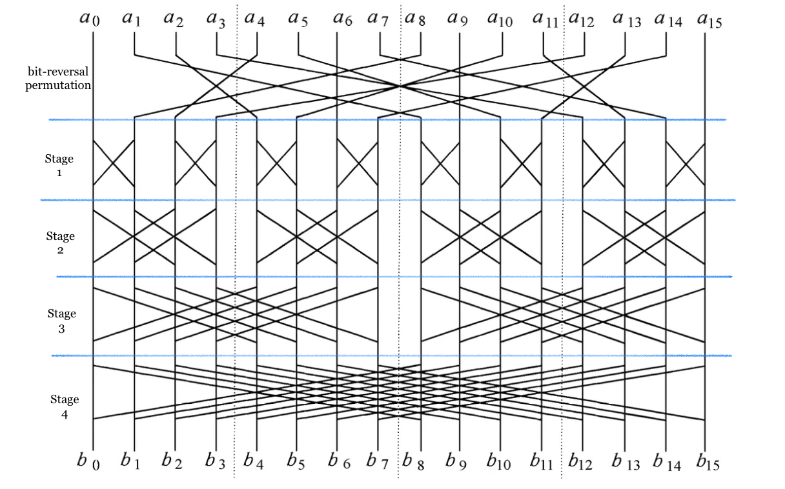
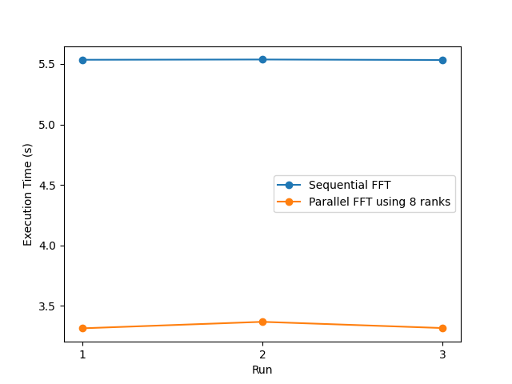
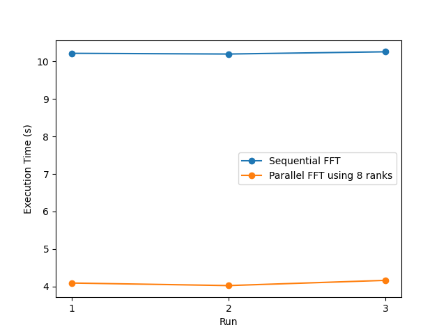
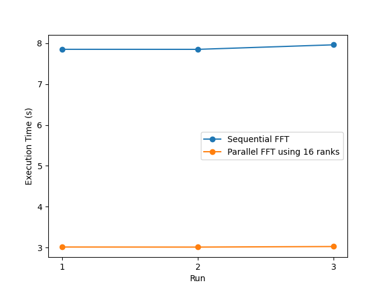

## Implementation of FFT using MPI

### 1. Introduction

This implementation of radix-2 FFT algorithms is based on [mpi4py](https://github.com/mpi4py/mpi4py) (Python bindings for the *Message Passing Interface*([MPI](https://www.mpi-forum.org/)) standard)

#### 1.1 Background

A **fast Fourier transform** (**FFT**) is an algorithm that computes the [discrete Fourier transform](https://en.wikipedia.org/wiki/Discrete_Fourier_transform) (DFT) of a sequence, or its inverse (IDFT). [Fourier analysis](https://en.wikipedia.org/wiki/Fourier_analysis) converts a signal from its original domain (often time or space) to a representation in the [frequency domain](https://en.wikipedia.org/wiki/Frequency_domain) and vice versa. (Source: [Wikipedia](https://en.wikipedia.org/wiki/Fast_Fourier_transform))

#### 1.2 Implementation Detail

##### 1.2.1 Procedure

1. Perform [bit-reversal permutation](https://en.wikipedia.org/wiki/Bit-reversal_permutation) on the input sequence
2. Assign  $N/P$ numbers to each rank
   + $N$: number of input sequence
   + $P$: number of rank
3. Each rank performs butterfly operations without inter-rank communication
   * For example, if $N/P=2$ (Each rank is assigned to 2 numbers), each rank can execute one stage (2-point FFT/DFT) of butterfly operations without communication because all the required data are present in its own memory
4. Perform butterfly operations with communication which includes identifying the partner, sending its data, and receiving the partner's data.

##### 1.2.2 Example

+ The diagram below is a FFT butterfly diagram ($N=16,P=4$)
+ [$a_0$, $a_1$, ..., $a_{15}$] is the input sequence
+ [$b_0$, $b_1$, ..., $b_{15}$] is the output sequence
+ Each rank is assigned to 4 numbers, e.g., Rank0 has [$a_0$, $a_1$, $a_2$, $a_3$]
+ Stage1 and Stage2 don't involve inter-rank communication
+ Inter-rank communication is necessary for Stage 3 and Stage 4.



##### 1.2.3 Limitation

`mpi_fft.py`has the following limitations:

1. The number of ranks must be a power of 2
2. The number of input data must be a power of 2
3. If the number of ranks is equal to or greater than the number of input data, the number of ranks will be set to the number of input data / 2

### 2. File
* **mpi_fft.py**

  An implementation of radix-2 FFT algorithms using mpi4py

* **input_generator.py**

  A input file generator that can generate $2^{N}$ random numbers in `input{N}.in`

* **input20.in**

  A input file contains $2^{20} = 1048576$ numbers
  
* **output20.out**

  Output file generated after applying FFT to the data in `input20.in`

* **local_test.sh**

  A shell script for testing in the local machine
  
* **mpi_fft.loc.out**

  An experiment output in the local machine (modified for `plot_exec_time.py`)

* **mpi_fft_8.out**

  An experiment output in CARC using 8 nodes (modified for `plot_exec_time.py`)

* **mpi_fft_16.out**

  An experiment output in CARC using 16 nodes (modified for `plot_exec_time.py`)

* **mpi_fft.job**

  A Slurm job script for CARC

* **plot_exec_time.py**

  A Python script for plotting execution time diagram 

* **sequential_fft.py**

  A purely sequential implementation of FFT

### 3. Experiment (Local)

#### 3.1 Experimental Setup

* **CPU**: Apple M1 Pro (8 physcal core)
* **Input**: input20.in ($2^{20} = 1048576$ numbers)

#### 3.2 Method

1. Run sequential FFT and parallel FFT (using 8 ranks) 3 times each version
2. Record the execution time of each run
3. Calculate the average execution time of sequential FFT and parallel FFT

#### 3.3 Experiment Shell Script

```bash
counter=0
NUM_RANKS=8
INPUT_FILE=input20.in
while [ $counter -lt 3 ]; do
  echo "***** Sequential FFT *****"
  mpiexec -n 1 python mpi_fft.py $INPUT_FILE
  echo "***** Parallel FFT using $NUM_RANKS ranks *****"
  mpiexec -n $NUM_RANKS python mpi_fft.py $INPUT_FILE
  let counter+=1
done
```

#### 3.4 Result

```bash
***** Sequential FFT *****
Execution time (s): 5.534702000000038
***** Parallel FFT using 8 ranks *****
Execution time (s): 3.3131210000000237
***** Sequential FFT *****
Execution time (s): 5.536771000000044
***** Parallel FFT using 8 ranks *****
Execution time (s): 3.3669069999999692
***** Sequential FFT *****
Execution time (s): 5.5329229999999825
***** Parallel FFT using 8 ranks *****
Execution time (s): 3.3153989999999567
```


|                                 | Sequential FFT    | Parallel FFT using 8 ranks |
| ------------------------------- | ----------------- | -------------------------- |
| Average Execution Time (Second) | 5.534798666666688 | 3.3318089999999834         |

#### 3.5 Analysis

The experimental results show that parallel FFT runs faster than sequential FFT in this experimental setup.

### 4. Experiment (USC CARC)

This experiment is carried out on CARC's general-use HPC cluster [Discovery](https://www.carc.usc.edu/user-information/user-guides/hpc-basics/discovery-resources) (using `main` Slurm partition)

#### 4.1 Experimental Setup

##### 4.1.1 Setup1

```bash
#SBATCH --nodes=8
#SBATCH --ntasks-per-node=1
INPUT_FILE=input20.in
```

##### 4.1.2 Setup2

```bash
#SBATCH --nodes=16
#SBATCH --ntasks-per-node=1
INPUT_FILE=input20.in
```

#### 4.2 Method

For each setup:

1. Run sequential FFT and parallel FFT 3 times each version
2. Record the execution time of each run
3. Calculate the average execution time of sequential FFT and parallel FFT

#### 4.3 Result

##### 4.3.1 Result of Setup1

```bash
==========================================
SLURM_JOB_ID = 17944065
SLURM_JOB_NODELIST = e06-01,e16-[07-10,12-14]
TMPDIR = /tmp/SLURM_17944065
==========================================
***** Serial FFT *****
Execution time (s): 10.21936251
***** Parallel FFT with 8 ranks *****
Execution time (s): 4.090738846
***** Serial FFT *****
Execution time (s): 10.200873646
***** Parallel FFT with 8 ranks *****
Execution time (s): 4.022454327
***** Serial FFT *****
Execution time (s): 10.260788844
***** Parallel FFT with 8 ranks *****
Execution time (s): 4.1618305
```


|                                 | Sequential FFT     | Parallel FFT using 8 ranks |
| ------------------------------- | ------------------ | -------------------------- |
| Average Execution Time (Second) | 10.227008333333334 | 4.091674557666667          |

##### 4.3.2 Result of Setup2

```bash
==========================================
SLURM_JOB_ID = 17944058
SLURM_JOB_NODELIST = d05-[26-31],e06-01,e16-[07-10,12-14,22-23]
TMPDIR = /tmp/SLURM_17944058
==========================================
***** Serial FFT *****
Execution time (s): 7.851430621
***** Parallel FFT with 16 ranks *****
Execution time (s): 3.012795118
***** Serial FFT *****
Execution time (s): 7.850583649
***** Parallel FFT with 16 ranks *****
Execution time (s): 3.011011899
***** Serial FFT *****
Execution time (s): 7.962012042
***** Parallel FFT with 16 ranks *****
Execution time (s): 3.024810756
```


|                                 | Sequential FFT    | Parallel FFT using 8 ranks |
| ------------------------------- | ----------------- | -------------------------- |
| Average Execution Time (Second) | 7.888008770666666 | 3.0162059243333332         |

##### 4.3.3 Result of Setup1 and Setup2


#### 4.4 Analysis

The experimental results show that 

+ parallel FFT runs faster than sequential FFT
+ parallel FFT (16 ranks) runs faster than parallel FFT (8 ranks)
