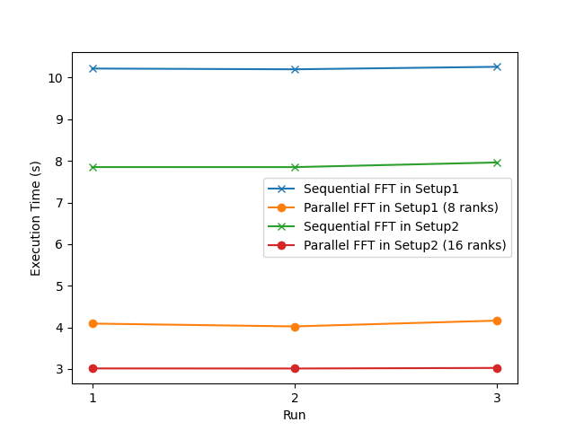
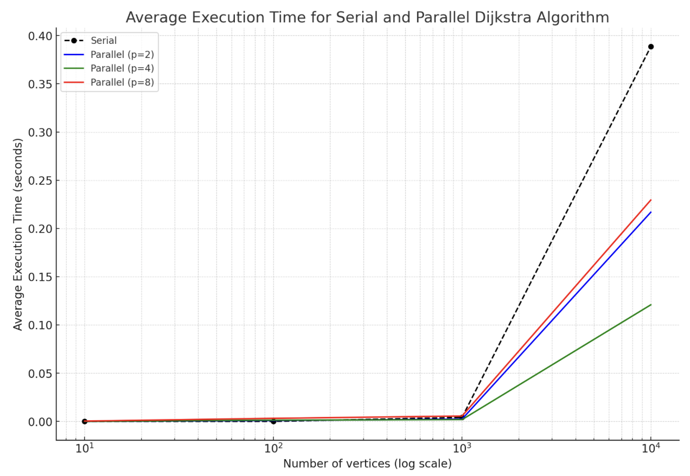

# CSCI596 Final Project - Paralle Computational Analysis of Various Alogrithms

## 1. Overview

This project demonstrates parallel computing with MPI and OpenMP through the implementation of four algorithms: Fast Fourier Transform, Dijkstra's Algorithm, Matrix Multiplication (using [MPI](https://www.mpi-forum.org/)), and the N-Queens algorithm (using OpenMP). These implementations highlight the efficiency of MPI in distributed computing and OpenMP in shared-memory parallelism, offering insights into tackling complex computational challenges in high-performance environments.

## 2. Project Structure

### 2.1 Fast Fourier Transform (FFT)

* **Purpose**: Perform the discrete Fourier transform (DFT) and its inverse (IDFT) to convert between time and frequency domains.
* **Implementation**: Utilizes radix-2 FFT algorithms via [mpi4py](https://github.com/mpi4py/mpi4py) (Python bindings for the *MPI*)
* **Further Reading**: For more details, including implementation nuances and performance analyses, see the [FFT documentation](FFT/README.md).

### 2.2 Dijkstra's Algorithm

* **Purpose**: Compute the shortest paths from a source node to all other nodes in a weighted graph.
* **Implementation**: Provides both serial and parallelized MPI-based solutions to explore performance under different system scales.
* **Further Reading**: Comprehensive information, including experimental setups and optimization strategies, is available in the [Dijkstra documentation](Dijkstra/README.md).

## 3. Result and Analysis

### 3.1 FFT

* **Parallel Efficiency**: The parallel FFT consistently outperforms its sequential counterpart, validating parallel processing as a means to enhance computational efficiency in FFT operations.

* **Scalability**: A clear reduction in execution time is observed when increasing the ranks from 8 to 16, demonstrating effective scalability of the parallel FFT approach.

### 3.2 Dijkstra's Algorithm

* **Improved Performance on Larger Graphs**: Parallel implementation shows significant performance gains as the number of vertices increases.
* **Optimal Process Count**: Best performance observed with a moderate number of processes (2 or 4), as using too many processes (e.g., 8) introduces communication overheads that outweigh computational benefits, especially on larger graphs.
* **Overhead in Small Graphs**: For small graphs (e.g., 10 vertices), the serial implementation is more efficient due to the overhead of parallelization in MPI.

## 4. Conclusion

The project's experimental outcomes, conducted on Apple M1 processor and the USC CARC HPC cluster, affirm that while parallel computing can substantially accelerate computations, the level of improvement is contingent on the task complexity, the number of processes, and the computing environment. These results advocate for the judicious application of parallel computing strategies to optimize algorithmic performance effectively.

## 5. Acknowledgement
* FFT part based on [MPI for Python](https://github.com/mpi4py/mpi4py)
* Dijkstra's part inspired by [Lehmannhen's MPI-Dijkstra GitHub repository](https://github.com/Lehmannhen/MPI-Dijkstra/tree/master)
