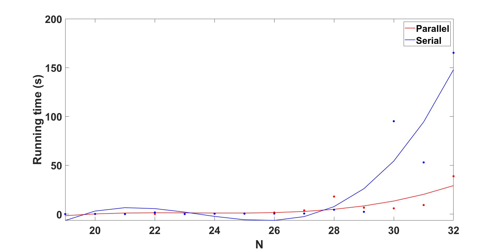

# Implementation of N-Queens problem using OpenMP

## 1. Introduction

This project uses OpenMP (Open Multi-Processing) to implement a extended version of the N-Queens problem in both serial and parallel modes. It compares the output data of these implementations to explore the relationship between computation time and problem size.

### 1.1 Background

**N-Queens problem:** Place n queens on an n*n chess board so that no two queens can be on the same horizontal, vertical, or diagonal line.

```bash

int k=1; //Search at the beginning of the second line
x[1] = -1;
while(k>0 && !resultfind){
    x[k]+=1;
    while((x[k]<n)&&!canput(x,k)){
        x[k]+=1;
    }
    if(x[k]<n){
        if(k==n-1){
            resultfind = true;
            return true;
        }else{
            k++;
            x[k]=-1;
        }
    }else{
        k--;
    }
}

```

Assuming that i-1 chess pieces have been placed in the first i-1 row of the board, place a chess piece in column j in row i, and infer whether this chess piece is placed in accordance with the rule. Assuming the rule is followed and i is not the last line, recurse the process until i is the last line (i==n-1). At this point, a solution to the problem is found, and the identifier is true, ending the recursion. Assuming that the pieces placed in column j in row i do not conform to the rules, empty the board directly, j+=1, and proceed to the inference in the next column.

### 1.2 Implementation Overview

Implementing Parallel Computing with OpenMP Programming. Each process executes in an arbitrary order independently of others, with distributed data storage featuring independent backups. Communication between processes is facilitated through various communication schemes.


1. Use the first thread to place a chess piece in row 1 and column 1 and use the algorithm in serial mode to continue placing until the final scheme is obtained. 

2. Use the second thread to place a chess piece in row 1 and column 2, and then use the algorithm in serial mode to continue placing until the final scheme is obtained. 

    ...

Set n threads to solve together, that is, the i thread can place a piece in row 1 column i, and then go down to perform the backtracking algorithm.

## 2. File
* **N-Queens_serial.cpp**

  Serial implementation of N-Queens problem in a single process

* **N-Queens_parallel.cpp**

  Parallel implementation of N-Queens problem mutiplication utilizing OpenMP
  
* **parallel.out**

  Output results file for parallel mode
  
* **serial.out**

  Output results file for serial mode

## 3. Experiment (Local)

### 3.1 Experimental Setup

* **CPU**: Intel(R) Core(TM) i5-8259U CPU @ 2.30GHz (4 physical cores / 8 logical cores)
* **Input**: N-queens size n = 19~32

### 3.2 Method

1. For each different N in the n-queen problem, record the time spent in serial computation and the time spent in parallel computation.
2. Compare the time spent in serial computation with the time spent in parallel computation.


### 3.3 Result




| Number of N |    Serial    |     Parallel   |
|-------------|--------------|----------------|
|           19|      0.001887|        0.023414|
|           20|      0.169977|        0.072978|
|           21|      0.007854|        0.065041|
|           22|       1.70067|        0.096222|
|           23|      0.026198|        0.086117|
|           24|      0.469532|        0.390804|
|           25|      0.592157|        0.423175|
|           26|      0.540686|         1.60238|
|           27|      0.607921|         3.82422|
|           28|       4.43235|         17.9967|
|           29|       2.33766|         6.62156|
|           30|       95.0944|         5.87741|
|           31|       52.9382|         9.25982|
|           32|       165.178|         38.7812|

### 3.4 Analysis

The experimental results show that:
+ Runtime tends to increase as the N increases.
+ When N is small, the advantage of parallel computing over serial computing is not obvious. This may be because parallel algorithms require some additional overhead, such as thread creation and synchronization. These costs may outweigh the benefits of parallel execution when the problem size is small. 
+ The performance improvement of parallel algorithms is usually more noticeable when the problem size is larger. For smaller problem sizes, the advantages of a serial algorithm may be more significant.
