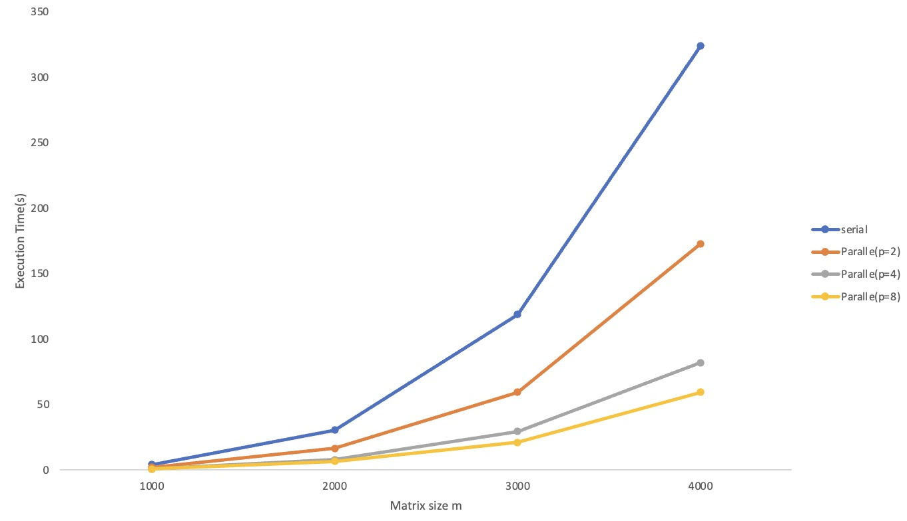

# Implementation of Matrix Multiplication using MPI

## 1. Introduction

This project uses MPI (Message Passing Interface) to explore the simple implementation of matrix multiplication algorithms in serial and parallel modes, examining the relationship between computation time and matrix size.The code and analyses are inspired by [GitHub:parallel-matrix-multiply](https://github.com/fengfu-chris/parallel-matrix-multiply).

### 1.1 Background

**Matrix Multiplication:** Given matrices A and B, where A is an m*p size matrix and B is a p*n size matrix. Solve for C = A*B. The simplest algorithm to solve this problem is to iterate through the rows of A and the columns of B to find the corresponding elements of C, with time complexity O(mnp) and space complexity O(1). 
```bash
for(int i=0; i<m; i++){
    for(int j=0; j<n; j++){
        float temp = 0.0;
        for(int k=0; k<p; k++){
            temp += A[i*p + k] * B[k*n + j];
        }
        C[i*n + j] = temp;
    }
}
```
In C++, this can be  implemented using a simple multiple loop as above. 
The elements of each row of matrix C are solved independently. When the matrices A and B are large, in order to save time, we can improve the above algorithm to parallelize the computation to solve the result.

### 1.2 Implementation Overview

Implementing Parallel Computing with ++ MPI Programming. Individual processes execute in an arbitrary time order and are not dependent on each other. Distributed storage of data with independent backups. Processes communicate with each other through multiple communication schemes.

1. Divide A and C into np chunks by rows.
2. The process reads the corresponding chunks of A and matrix B according to the process number.
3. Each process solves the corresponding chunk of C base on the process number.

## 2. File
* **matrix_serial.cpp**

  Serial implementation of matrix multiplication in a single process

* **matrix_mpi.cpp**

  Parallel implementation of matrix mutiplication utilizing MPI
  
* **make.sh**

  A shell script for Compiling 
  
* **localTest.sh**

  A shell script for testing in the local machine
  
* **results.out**

  Output results file

## 3. Experiment (Local)

### 3.1 Experimental Setup

* **CPU**: Apple M1 Pro (8 physical cores)
* **Input**: Matrix size m=1000, 2000, 3000, 4000, with fixed value p=2000, n=3000.

### 3.2 Method

1. For each matrix size m, execute parallel computation of matrix mutipication using 2, 4, 8 processes with serial computation.
2. Record the execution time of each execution, calculate the average of the serial computation time results.


### 3.3 Result




| Number of m |    Serial    | Parallel (p=2) | Parallel (p=4) | Parallel (p=8) |
|-------------|--------------|----------------|----------------|----------------|
|         1000|          4.01|         1.90614|         0.76092|         0.71469|
|         2000|         30.50|        16.56475|         7.72016|         6.47323|
|         3000|        118.93|        59.37654|        29.43350|        21.07685|
|         4000|        324.18|       172.93488|        82.09531|        59.29916|

### 3.4 Analysis

The experimental results show that
+ Runtime tends to decrease as the process increases.
+ For relatively small matrices the advantage of parallel computation over serial is not obvious.
+ The larger the matrix size the better the performance of parallel computing in terms of runtime savings. Thus parallel computing helps us to process larger input data faster.
